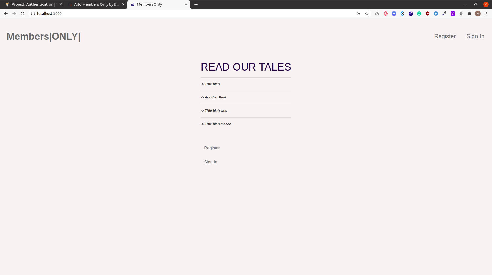

# members_only

This is a project in the Ruby on Rails curriculum at [Microverse](https:www.microverse.org/) - @microverseinc

The project specifications can be found on [Ruby on Rails
PROJECT: AUTHENTICATION](https://www.theodinproject.com/courses/ruby-on-rails/lessons/authentication)



## Built With
- Ruby
- Rails

## Description
- On this site, only registered members can create posts and view the authors of existing posts.
Non-members can view the posts but can't view the authors.

- The Rails framework was used to build this project.

## Live Demo

[Live Demo]()

### Run instructions 
-  You can clone the GitHub repo and type the following commands in the terminal to run the bot locally 
    ```
    bundle install
    rake db:migrate
    rails server
    ```

### How to use the site
Make sure the server is running
- Go to http://localhost:3000/ in your web browser
- You will be able to access the following routes (among others)
- Follow the links on the site to access the available features, including sign up and sign in functionality.

## Deployment
- You can deploy on [Heroku](https://devcenter.heroku.com/categories/ruby-support).

## Authors

👤 **Ritta Buyaki**
- Github: [@Buyaki01](https://github.com/Buyaki01)
- Twitter: [ @BuyakiRitta](https://twitter.com/BuyakiRitta)
- Linkedin: [Ritta Buyaki](https://www.linkedin.com/in/ritta-buyaki-b12904128/)

👤 **Marylene Sawyer**
- Github: [@Bluette1](https://github.com/Bluette1)
- Twitter: [@MaryleneSawyer](https://twitter.com/MaryleneSawyer)
- Linkedin: [Marylene Sawyer](https://www.linkedin.com/in/marylene-sawyer)


# Acknowledgements
- [The Devise Gem](https://github.com/heartcombo/devise)

## 🤝 Contributing

Contributions, issues and feature requests are welcome!

Feel free to check the [issues \
age](https://github.com/Bluette1/members_only/issues).

## Show your support

Give a ⭐️ if you like this project!

## 📝 License

This project is [MIT](https://opensource.org/licenses/MIT) licensed.
